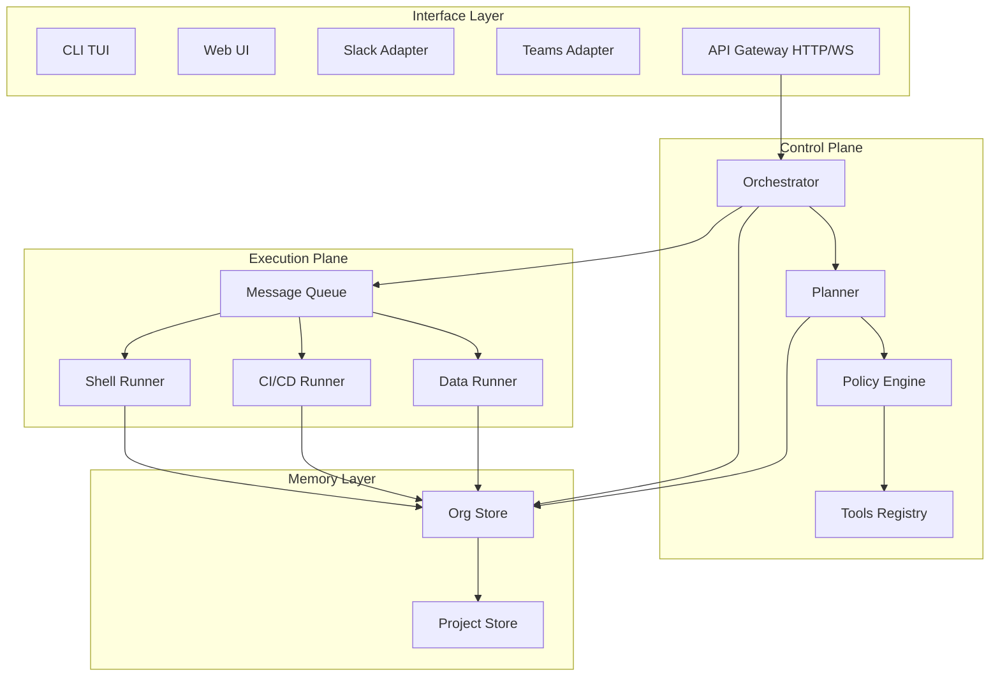

# Spec: Fase 0 — Fundación Documental

## Requirements

### Functional
- [x] REQ-F1: Cada doc de `docs/01-` a `docs/07-` debe existir en español e inglés
- [x] REQ-F2: Cada ADR debe seguir formato YADR (Context, Options, Decision, Rationale, Consequences)
- [x] REQ-F3: Cada diagrama Mermaid debe renderizar sin errores de sintaxis
- [x] REQ-F4: Todos los términos técnicos (orchestrator, planner, runner, policy engine, control plane, execution plane, memory stores, tools registry, goal, plan, tool, job) deben mantenerse en inglés en ambas versiones
- [x] REQ-F5: Cada documento debe ser auto-contenido (puede leerse independientemente)
- [x] REQ-F6: Los documentos deben referenciarse entre sí con links relativos

### Non-Functional
- [x] REQ-NF1: Cada doc debe tener entre 200-800 líneas (suficiente profundidad sin ser enciclopédico)
- [x] REQ-NF2: Debe mantener consistencia terminológica con el README existente
- [x] REQ-NF3: Los diagramas Mermaid deben ser comprensibles sin contexto adicional
- [x] REQ-NF4: Fecha de última actualización en cada documento
- [x] REQ-NF5: Cada doc del 01-07 debe terminar con "Siguiente: [link al siguiente doc]"

## Content Specs

### docs/01-overview.md — Visión General
- Qué es CaS (elevator pitch)
- Problema que resuelve: agentes corporativos no orquestados, falta de control y auditoría
- Conceptos clave: Goal, Plan, Tool, Job, Runner, MemoryItem
- Arquitectura en una frase: 4 planos (Interface, Control, Execution, Memory)
- Usuarios target: arquitectos, devs, ops, security, business stakeholders
- Cómo leer esta documentación (guía de navegación)
- Relación con el ecosistema (Claude Code, Codex CLI, Opencode, OpenClaw, Semantic Kernel)

### docs/02-architecture-logical.md — Arquitectura Lógica
- Vista general de los 4 planos
- Diagrama de componentes (descripción textual detallada + referencia al Mermaid)
- Flujo de datos: User → Goal → Plan → Jobs → Runners → Memory
- Comunicaciones: sincrónicas (HTTP/WS) y asincrónicas (cola de mensajes)
- Límites de despliegue y responsabilidades
- Tolerancia a fallos y estrategias de retry

### docs/03-control-plane.md — Control Plane
- API Gateway: endpoints, autenticación OIDC/JWT, rate limiting, WebSocket management
- Orchestrator: ciclo de vida de Goal, Plan como DAG, state machine, publicar jobs
- Planner: construcción de prompts, integración multi-LLM, parsing de salida estructurada
- Policy Engine: OPA/Rego, inputs (usuario, rol, dominio, tool, entorno), outputs (ALLOW/DENY/REQUIRE_APPROVAL), modos de autonomía
- Tools Registry: descriptors tool.yaml, GET /tools, versionado, validación de seguridad

### docs/04-execution-plane.md — Execution Plane
- Shell Runner: ciclo de vida de contenedor efímero, sandboxing, resource limits, network profiles
- CI/CD Runner: bridge a GitHub Actions/GitLab CI/Jenkins
- Data Runner: pandas, SQLAlchemy, SQL, reporting
- Job queue: publicación y consumo de mensajes
- Logging y streaming de estado en tiempo real
- Gestión de credenciales (vault, scoped tokens)

### docs/05-memory-and-context.md — Memoria y Contexto
- OrgStore: tabla OrgMemoryItem (orgId, domain, summary, tags, createdAt, source)
- ProjectStore: tabla ProjectMemoryItem (projectId, summary, type, link)
- Búsqueda semántica: embeddings + vector store (pgvector)
- Patrones: escribir memoria al finalizar Goal, inyectar contexto al planificar nuevo Goal
- Changelog/lab-notes para proyectos long-running
- Resúmenes automáticos con LLM

### docs/06-security-and-compliance.md — Seguridad y Compliance
- Modos de autonomía: consultivo (pregunta siempre), semi-autónomo (auto en rango), autónomo (full-auto con sandbox)
- Policy Engine con OPA: estructura de reglas, ámbitos (dominio, rol, tool, entorno)
- Auditoría: tabla de eventos (qué, quién, cuándo, con qué parámetros, decisión de política)
- Aislamiento de red: profiles (none, outbound-only, full), resource quotas
- Secrets management: HashiCorp Vault, scoped tokens, rotación automática
- Data governance: catálogos de sensibilidad, acceso segmentado por rol
- Compliance: SOC2, GDPR, SOX consideraciones

### docs/07-domain-verticals.md — Verticales de Dominio
- Concepto: mini-DSLs de negocio sobre CaS
- Cómo crear una vertical: definir vocabulario → mapear a tools → definir KPIs
- Vertical: DevOps (infra + CI/CD + monitoring + migrations)
- Vertical: Marketing (campañas multicanal + analytics + A/B testing)
- Vertical: Finance (reporting + SQL + dashboards + alertas)
- Extensibilidad: plugin system para nuevas verticales

### ADR-001: Elección de Arquitectura
- Context: CaS necesita soportar múltiples clientes (CLI, Web, Slack, Teams, WhatsApp) con sesiones persistentes
- Options Considered: A) Single-process renderer (Claude Code), B) Daemon+Thin Clients (Opencode/OpenClaw), C) Hybrid
- Decision: B — Daemon/Gateway + Thin Clients
- Rationale: multi-cliente nativo, sesiones persistentes, extensibilidad
- Consequences: complejidad operacional, lifecycle management, auth entre procesos

### ADR-002: Modelo de Seguridad
- Context: Corporate deployments requieren control granular sobre qué pueden hacer los agentes
- Options: OPA/Rego, custom engine, AWS Cedar, Open Policy Model
- Decision: OPA/Rego
- Rationale: declarativo, testeable, ampliamente adoptado en enterprise, policy-as-code
- Consequences: learning curve, performance overhead en evaluaciones complejas

### Diagramas Mermaid

#### logical-architecture.mmd

#### sequence-goal-to-execution.mmd
User → API Gateway → Orchestrator → Planner → Policy Engine → Tools Registry → Runner → Memory → User
